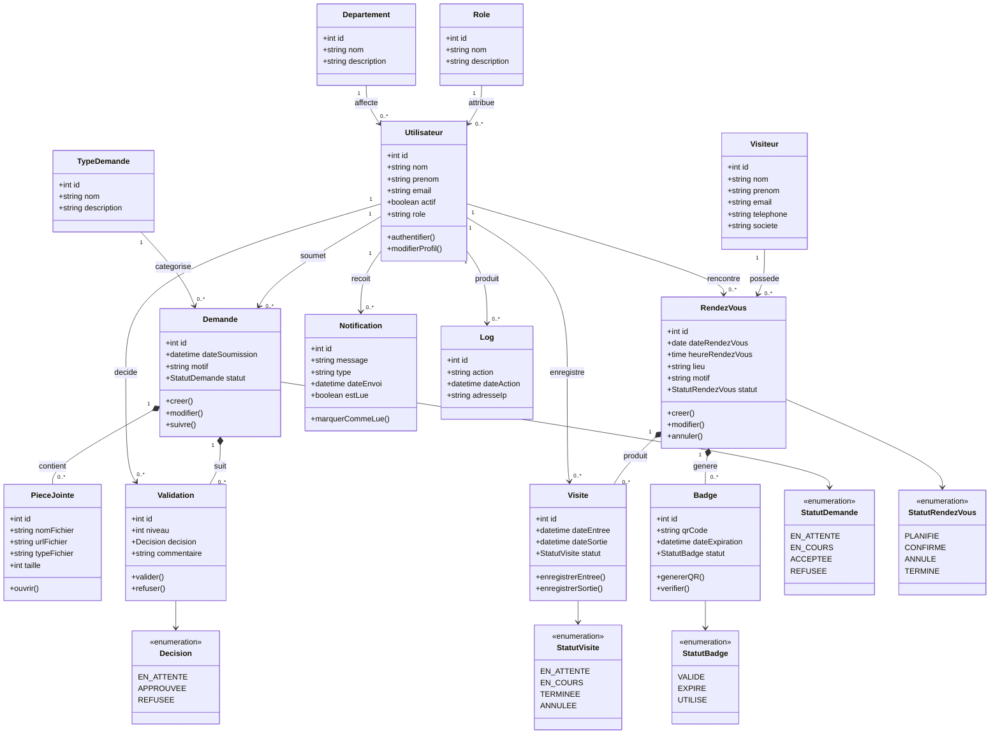

# Diagramme de classes

Le diagramme reprend les principales entites metier du portail et leurs relations.
Il peut etre rendu directement par Mermaid dans GitHub, VS Code ou Mermaid Live.

```mermaid
classDiagram
    class Role {
        +int id
        +string nom
        +string description
    }

    class Departement {
        +int id
        +string nom
        +string description
    }

    class Utilisateur {
        +int id
        +string nom
        +string prenom
        +string email
        +boolean actif
        +string role
        +authentifier()
        +modifierProfil()
    }

    class Visiteur {
        +int id
        +string nom
        +string prenom
        +string email
        +string telephone
        +string societe
    }

    class TypeDemande {
        +int id
        +string nom
        +string description
    }

    class Demande {
        +int id
        +datetime dateSoumission
        +string motif
        +StatutDemande statut
        +creer()
        +modifier()
        +suivre()
    }

    class PieceJointe {
        +int id
        +string nomFichier
        +string urlFichier
        +string typeFichier
        +int taille
        +ouvrir()
    }

    class Validation {
        +int id
        +int niveau
        +Decision decision
        +string commentaire
        +valider()
        +refuser()
    }

    class RendezVous {
        +int id
        +date dateRendezVous
        +time heureRendezVous
        +string lieu
        +string motif
        +StatutRendezVous statut
        +creer()
        +modifier()
        +annuler()
    }

    class Badge {
        +int id
        +string qrCode
        +datetime dateExpiration
        +StatutBadge statut
        +genererQR()
        +verifier()
    }

    class Visite {
        +int id
        +datetime dateEntree
        +datetime dateSortie
        +StatutVisite statut
        +enregistrerEntree()
        +enregistrerSortie()
    }

    class Notification {
        +int id
        +string message
        +string type
        +datetime dateEnvoi
        +boolean estLue
        +marquerCommeLue()
    }

    class Log {
        +int id
        +string action
        +datetime dateAction
        +string adresseIp
    }

    class StatutDemande {
        <<enumeration>>
        EN_ATTENTE
        EN_COURS
        ACCEPTEE
        REFUSEE
    }

    class Decision {
        <<enumeration>>
        EN_ATTENTE
        APPROUVEE
        REFUSEE
    }

    class StatutRendezVous {
        <<enumeration>>
        PLANIFIE
        CONFIRME
        ANNULE
        TERMINE
    }

    class StatutBadge {
        <<enumeration>>
        VALIDE
        EXPIRE
        UTILISE
    }

    class StatutVisite {
        <<enumeration>>
        EN_ATTENTE
        EN_COURS
        TERMINEE
        ANNULEE
    }

    Role "1" --> "0..*" Utilisateur : attribue
    Departement "1" --> "0..*" Utilisateur : affecte
    Utilisateur "1" --> "0..*" Demande : soumet
    TypeDemande "1" --> "0..*" Demande : categorise
    Demande "1" *-- "0..*" PieceJointe : contient
    Demande "1" *-- "0..*" Validation : suit
    Utilisateur "1" --> "0..*" Validation : decide
    Visiteur "1" --> "0..*" RendezVous : possede
    Utilisateur "1" --> "0..*" RendezVous : rencontre
    RendezVous "1" *-- "0..*" Badge : genere
    RendezVous "1" *-- "0..*" Visite : produit
    Utilisateur "1" --> "0..*" Visite : enregistre
    Utilisateur "1" --> "0..*" Notification : recoit
    Utilisateur "1" --> "0..*" Log : produit

    Demande --> StatutDemande
    Validation --> Decision
    RendezVous --> StatutRendezVous
    Badge --> StatutBadge
    Visite --> StatutVisite
```