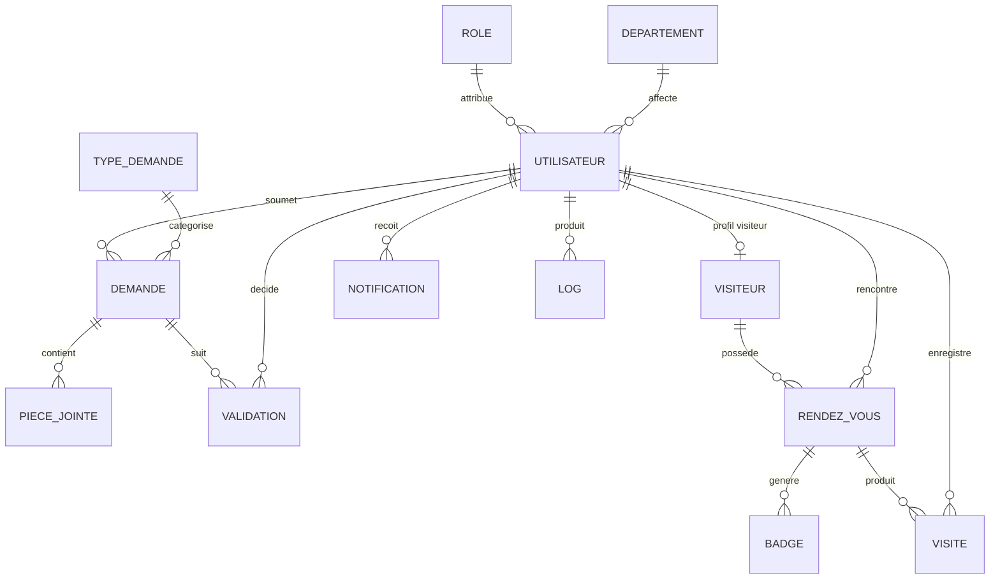

# Modèle de données

## Entités principales

## Règles d'intégrité

- Un visiteur peut être lié à un compte utilisateur par `visiteur.utilisateur_id`.
- Une demande appartient à un collaborateur.
- Une demande possède une validation de niveau 1, puis éventuellement une validation de niveau 2.
- Le niveau 2 n'est possible qu'après approbation du niveau 1.
- Un badge est lié à un rendez-vous confirmé.
- Une visite est liée à un rendez-vous et à l'agent d'accueil qui l'enregistre.
- Les notifications sont liées à un utilisateur et peuvent référencer une demande ou un rendez-vous.
- Les logs conservent les actions importantes et sont immuables par l'API.

Le schéma complet et les contraintes SQL sont dans `database/portail_services.sql`.
